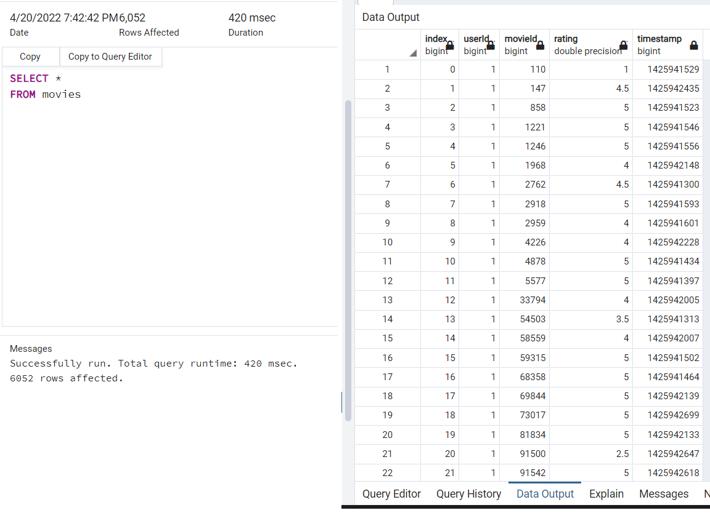
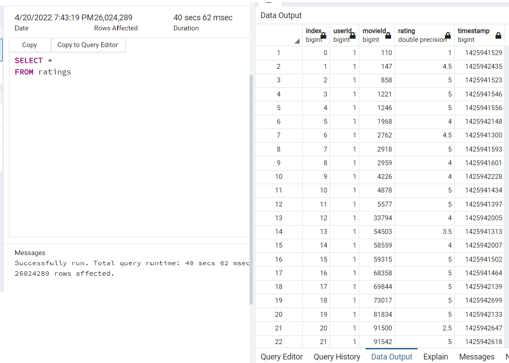

# Movies-ETL Analysis

Resources:
 - Python 3.7; Jupyter Notebook
 - Postgres SQL; PGAdmin

Project Overview:

This project was created for Amazing Prime and provides code that can be reused on a regular basis. The purpose was to create an automated pipeline that pulls in and transforms new data, and loads it into existing tables. Using refactored code, a function was created to take in movie data files and perform the ETL process by adding the data to a PostgreSQL database.

The four deliverables below were submitted:

 - Deliverable 1: Write an ETL Function to Read Three Data Files
 - Deliverable 2: Extract and Transform the Wikipedia Data
 - Deliverable 3: Extract and Transform the Kaggle data
 - Deliverable 4: Create the Movie Database

 Database Output:

 The below images confirm all rows were imported into the database.

 

 
